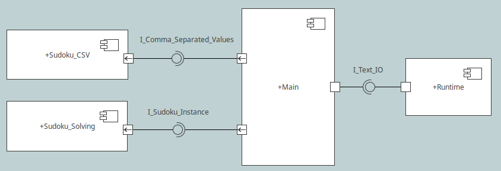

# Sudoku_Solver
Sudoku_Solver is an automated solver for the game
[Sudoku](https://en.wikipedia.org/wiki/Sudoku).
The solver in written in
[Ada SPARK](https://en.wikipedia.org/wiki/SPARK_(programming_language)),
and thus evidence for compliance with respect to some requirements may be
verified formally. Furthermore, Ada SPARK can also guarantee the absence of
runtime errors, e.g. illegal assignments to ranged types.

## Building
```console
john@localhost:Sudoku_Solver$ gprbuild sudoku_solver.gpr
```

## Running
```console
john@localhost:Sudoku_Solver$ ./obj/main < examples/world_hardest_sudoku.csv 
```

## High-Level Requirements
The Sudoku_Solver shall load an (incomplete) 9x9 Sudoku instance from STDIN,
solve the Sudoku problem, and finally emit the solved instance to STDOUT.
When there is no infeasible solution available, the program shall terminate
with an error code.

## Software Design
Sudoku_Solver operates on a CSV file with 9 rows and 9 columns, where each cell
is separated by the comma character, and each row is separated by a linebreak.
No spaces, comments, or headers are allowed in the CSV file. Each cell must
contain a single digit between zero and nine, where zero represents incomplete
Sudoku values. Consequently, each CSV file is exactly 162 characters long (18*9).
Internally, the content of a CSV file is refereed to as a Sudoku instance,
an array of 81 digits (0-9).

The Main component reads text from STDIN using a Runtime component provided by
Ada SPARK, decodes the text into a Sudoku instance using the Sudoku_CSV component,
then sends the instance to the Sudoku_Solver component. When the Sudoku_Solver
finds a solution, the Main component encodes the solved instance into CSV text
and emits it to STDOUT using the Runtime component.



## Low-Level Requirements
TBD

## Verification Procedure
TBD

## Reporting Bugs
If you encounter problems with Sudoku_Solver, please
[file a github issue](https://github.com/john-tornblom/Sudoku_Solver/issues/new).
If you plan on sending pull requests which affect more than a few lines of code,
please file an issue before you start to work on you changes. This will allow us
to discuss the solution properly before you commit time and effort.

## License
Sudoku_Solver is licensed under the GPLv3, see LICENSE for more information.
